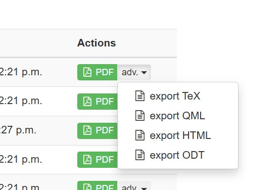

# Перенос задач между различными платформами
{: .no_toc }

<details open markdown="block" class="toc-h2-only">
  <summary>Содержание</summary>
  {: .text-delta }
- TOC
{:toc}
</details>

---

## Из Pho.rs в Oly-exams

Чтобы получить выгрузку XML, пригодную для вставки в Oly, пользователь с правами редактора на Pho.rs должен открыть в адресной строке `Pho.rs/p/123/oly`, где `123` — номер нужной задачи. Полученный код вставляется в Version node.

При открытии задачи на самом сайте может произойти `Server Error`. Обычно причина — LaTeX, который не компилируется в Oly (например, `\begin{align} \end{align}`).

После переноса нужно поправить несколько неизбежных ошибок:

1. Перенести картинки (изначально стоит заглушка `figid='25'`).
2. Поправить переносы строк (могут исчезать).
3. Проверить LaTeX.
4. Перевести image captions — по умолчанию они переносятся из русской версии задачи на Pho.rs.


## Из Oly-exams в Pho.rs

### Выгрузка из OLy

Ниже приведён скрипт на `Python`, который позваляет выгрузить все доступные переводы.

```python
import os
import requests
from bs4 import BeautifulSoup
from urllib.parse import urljoin


BASE_URL = "https://ispho2025.siriusolymp.ru"
LOGIN_URL = urljoin(BASE_URL, "/accounts/login/")
USERNAME = "RUS"
PASSWORD = "jam-7Qd-A4Q-aYR"
QUEST_IDS = [18]
MAX_LANG = 100


os.makedirs("tex", exist_ok=True)
os.makedirs("xml", exist_ok=True)


def get_csrf_token(session):
    response = session.get(LOGIN_URL)
    soup = BeautifulSoup(response.text, 'html.parser')
    token = soup.find('input', {'name': 'csrfmiddlewaretoken'})['value']
    return token


def login(session, csrf_token):
    login_data = {
        'username': USERNAME,
        'password': PASSWORD,
        'csrfmiddlewaretoken': csrf_token
    }
    headers = {
        'Referer': LOGIN_URL
    }
    session.post(LOGIN_URL, data=login_data, headers=headers)


def download_files(session):
    for lang_id in range(1, MAX_LANG + 1):
        for quest_id in QUEST_IDS:
            #TEX
            tex_url = urljoin(BASE_URL, f"/exam/tex/question/{quest_id}/lang/{lang_id}")
            tex_response = session.get(tex_url)
            if tex_response.status_code == 200:
                tex_filename = os.path.join("tex", f"{lang_id}-{quest_id}.tex")
                try:
                    with open(tex_filename, 'w', encoding='UTF-8') as f:
                        f.write(tex_response.text)
                except Exception:
                    print("Error in TEX")

            #XML
            xml_url = urljoin(BASE_URL, f"/exam/translation/export/question/{quest_id}/lang/{lang_id}")
            xml_response = session.get(xml_url)
            if xml_response.status_code == 200:
                xml_filename = os.path.join("xml", f"{lang_id}-{quest_id}.xml")
                try:
                    with open(xml_filename, 'w', encoding='UTF-8') as f:
                        f.write(xml_response.text)
                except Exception:
                    print("Error in XML")

            print(f"Processed lang {lang_id}, question {quest_id}")


def main():
    session = requests.Session()

    csrf_token = get_csrf_token(session)

    login(session, csrf_token)

    download_files(session)


if __name__ == "__main__":
    main()
```

Так же можно вручную скачать xml файл из раздела `Exam → View all translations`



### Загрузка на Pho.rs

TODO

## Из Oly-exams в SiriusOlymp

TODO
