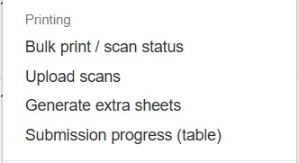
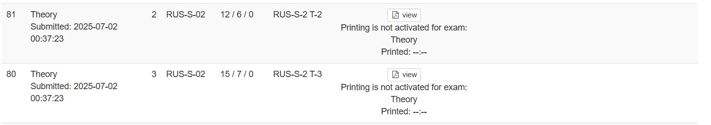
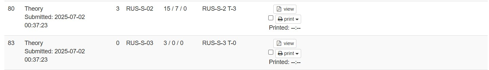
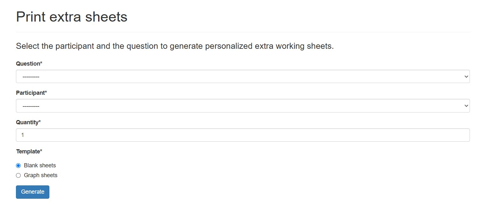

# Настройка печати с oly-exams
{: .no_toc }

<details open markdown="block" class="toc-h2-only">
  <summary>Содержание</summary>
  {: .text-delta }
- TOC
{:toc}
</details>

---

Репозитории:

- **print_server:** <https://gitlab.com/oly-exams/print_server/>
- **exam_tools:** <https://gitlab.com/oly-exams/exam_tools>
- **ZeroTier:** <https://docs.zerotier.com/>

---

## 1. Компоненты

- **print_server** — сервер печати на CUPS + gunicorn + nginx.
- **exam_tools** — основной сервер, который отправляет задания на print_server.
- **ZeroTier** — Вариант создания сети между двумя серверами.

---

## 2. Развёртывание print_server

### 2.1. Установка зависимостей

```bash
sudo apt update
sudo apt install -y git cups libcups2-dev python3-dev python3-virtualenv curl nginx
```

В `/etc/apt/sources.list` закомментируйте строку с `cdrom`.

### 2.2. Клонирование репозитория

```bash
git clone https://gitlab.com/oly-exams/print_server.git
cd print_server
```

### 2.3. Подключение к ZeroTier

ZeroTier нужен, чтобы print_server и exam_tools находились в одной внутренней сети. Благодаря этому print_server не нужно выставлять в интернет.

```bash
sudo curl -s https://install.zerotier.com | sudo bash
sudo systemctl enable zerotier-one
sudo systemctl start zerotier-one
sudo zerotier-cli join your_net_id
```

Проверка статуса:

```bash
sudo zerotier-cli status
sudo zerotier-cli listnetworks
```

Если появляется ошибка об отсутствии service-файла, скорее всего ZeroTier уже запущен.

Запишите IP-адрес, который ZeroTier выдал print_server. Он понадобится в настройках `exam_tools`. Если узел не авторизован, попросите администратора сети добавить его.

### 2.4. Настройка CUPS

Откройте `/etc/cups/cupsd.conf` и в первых трёх блоках `<Location ...>` оставьте только:

```apache
Order allow, deny
Allow @LOCAL
```

Затем включите и запустите CUPS:

```bash
sudo systemctl enable cups
sudo systemctl start cups
```

### 2.5. Добавление принтеров

Откройте в браузере:

```text
http://localhost:631
```

Добавьте принтеры через веб-интерфейс CUPS. Запомните имена очередей (queue name) — они будут использоваться в `PRINTERS_MAP`.

### 2.6. Python-окружение

```bash
python3 -m virtualenv venv
source venv/bin/activate
pip install -r requirements.txt
```

### 2.7. Ansible: inventory и group_vars

В каталоге `print_server/inventory/` создайте файл `location_name`:

```ini
[location_name]
localhost              ansible_connection=local
```

В каталоге `print_server/group_vars/` создайте файл `location_name.yml`:

```yaml
---
API_SECRET: 'YourAPIKey'
UPLOAD_FOLDER: '{{ project_root }}/uploads'
PRINT_LOG: '/var/log/iphoprint.printjobs.log'
PRINTERS_MAP:
    WebsitePrinterName: 'PrinterName'
```

Где:
- `location_name` — произвольное имя, но оно должно совпадать в трёх местах: имя inventory-файла, имя group_vars-файла и аргумент `-i inventory/location_name` при запуске playbook.
- `YourAPIKey` — API-ключ, который затем указывается в `exam_tools` как `auth_token`.
- `PrinterName` — имя очереди принтера в CUPS.
- `WebsitePrinterName` — имя принтера, которое будет использоваться на стороне сайта.

### 2.8. Запуск playbook

```bash
ansible-playbook -i inventory/location_name deploy.yml
```

Playbook настраивает приложение, nginx и gunicorn. После успешного выполнения print_server слушает порт `80` внутри сети ZeroTier. Публиковать этот порт в интернет не нужно.

### 2.9. Автозапуск

Обеспечьте автоматический запуск print_server после перезагрузки. Это можно сделать через systemd или cron. В репозитории есть скрипт `start_gunicorn`, который можно взять за основу:

```bash
#!/bin/bash
./venv/bin/gunicorn run:app \
  --env 'IPHOPRINT_SETTINGS=/etc/iphoprint.cfg' \
  --workers=4 \
  --bind=0.0.0.0:80 \
  --log-level=debug \
  --log-file=-
```

---

## 3. Настройка exam_tools

### 3.1. Редактирование `settings_common.py`

Откройте файл:

```text
exam_tools/settings_common.py
```

Найдите словарь `PRINTER_QUEUES` и добавьте принтер:

```python
PRINTER_QUEUES = {
    "DBPrinterName": {
        "name": "UIPrinterName",
        "host": "print_server_ip",
        "queue": "WebsitePrinterName",
        "auth_token": "YourAPIKey",
        "opts": {"Duplex": "None", "ColourModel": "Colour", "Staple": "1PLU"},
        "required_perm": "ipho_core.can_print_exam_site",
    },
}
```

Параметры:
- `DBPrinterName` — имя принтера внутри базы данных сайта.
- `UIPrinterName` — имя, которое отображается в пользовательском интерфейсе.
- `print_server_ip` — IP-адрес print_server в сети ZeroTier.
- `WebsitePrinterName` — должен совпадать с ключом в `PRINTERS_MAP` в `group_vars/location_name.yml`.
- `YourAPIKey` — должен совпадать с `API_SECRET` в `group_vars/location_name.yml`.
- `opts` — параметры печати: дуплекс, цвет, скрепление и т.п.
- `required_perm` — право, необходимое для доступа к принтеру. Для печати экзамена используется `ipho_core.can_print_exam_site`.

### 3.2. Перезапуск основного сервера

После изменения `settings_common.py` перезапустите `exam_tools`:

```bash
sudo systemctl restart <имя_сервиса_exam_tools>
```

---

## 4. Проверка

1. Убедитесь, что print_server и exam_tools пингуют друг друга по ZeroTier.
2. На print_server проверьте доступность приложения:
   ```bash
   curl http://localhost/print/
   ```
   Ожидается страница `IPhO Print Server`.
3. С основного сервера проверьте доступность print_server по ZeroTier-адресу:
   ```bash
   curl http://print_server_ip/print/
   ```
4. Отправьте тестовое задание на печать через интерфейс `exam_tools`.
5. Смотрите лог заданий на print_server:
   ```bash
   tail -f /var/log/iphoprint.printjobs.log
   ```

---

## 6. Частые ошибки

- **403 / ошибка авторизации** — не совпадают `auth_token` в `exam_tools` и `API_SECRET` в print_server.
- **400 / очередь не найдена** — `queue` в `exam_tools` не совпадает с ключом `PRINTERS_MAP` в print_server.
- **CUPS недоступен** — проверьте `/etc/cups/cupsd.conf`, наличие `Allow @LOCAL` и статус `cups`.
- **ZeroTier-узел не авторизован** — попросите администратора сети добавить узел.
- **Принтер не печатает** — проверьте, что очередь CUPS совпадает с `PrinterName` в `PRINTERS_MAP`, и что принтер доступен в CUPS.
- **print_server недоступен с exam_tools** — проверьте, что оба сервера в одной сети ZeroTier и что IP в `host` указан верно. Публичные порты открывать не требуется.
- **print_server недоступен с exam_tools** — проверьте, что оба сервера в одной сети ZeroTier и что IP в `host` указан верно. Публичные порты открывать не требуется.

---
## 7 Печать



### До фазы



У всего staff есть доступ к вкладке печати. До начала фазы там доступен просмотр файлов на печать без водяных знаков — таким образом можно печатать до начала фазы. Пометка «когда было напечатано» пуста, но её можно заполнить через `django admin → print logs`.

### Во время фазы



В той же вкладке у каждого «документа» появляется выбор принтера и кнопка печати. После печати пометка «когда было напечатано» заполняется автоматически.

### Во время тура



Во вкладке `Admin tools → Generate Extra Sheets` создаются дополнительные листы для участников по конкретным задачам. Внутри сайта ведётся нумерация всех доп. листов для участника по конкретной задаче, поэтому при генерации будут создаваться листы с новыми номерами.
