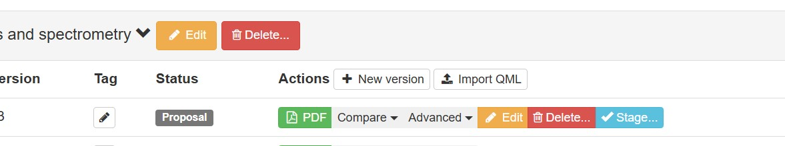
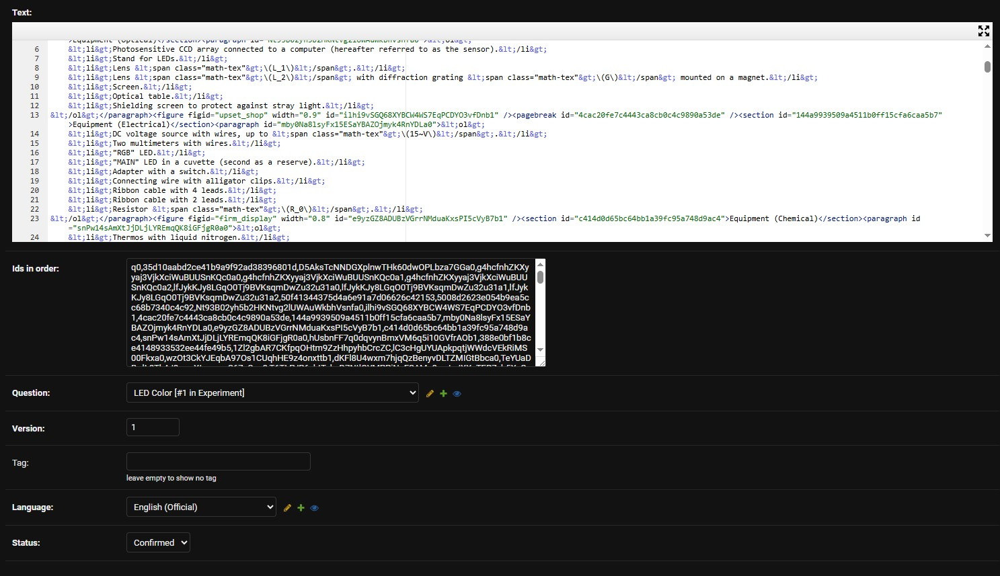

# Заливка задач на oly-exams
{: .no_toc }

<details open markdown="block" class="toc-h2-only">
  <summary>Содержание</summary>
  {: .text-delta }
- TOC
{:toc}
</details>

---

## Заливка через интерфейс

Загрузить задачу через интерфейс сайта можно только при создании новой версии задачи(в том числе и самой первой).

Для этого корректный xml файл необходимо выбрать после нажатия на кнопку `Import QML`.



При такой загрузке часто сайт не принимает файл, из-за ощибок по типу "Отсутсвие `fig_id`".

---
## Заливка напряиую в базу данных

За редактирование от имени админа отвечают две вкладки:

- `django admin → Problems nodes`
- `django admin → Version nodes`

В **Problems nodes** редактируются только общие сведения.

В **Version nodes** редактируется XML задачи. При первом редактировании Django будет требовать заполнить поле `Ids` — туда можно поставить любую заглушку. Это поле начнёт использоваться сайтом после финализации версии: по нему переводы привязываются к id блоков.



Блоки, которые чаще всего встречаются:

- **Title**
  ```xml
  <title id="title0"> text </title>
  ```
- **Part**
  ```xml
  <part min_points="0.0" max_points="0.0" id="a85326faa2f0490b9ea028b65aa025dc"> text </part>
  ```
- **Paragraph**
  ```xml
  <paragraph id="e5ddddb02c6848ee955b3c5f6fcbcf22"> text </paragraph>
  ```
- **Figure**
  ```xml
  <figure figid="enter_figid" width="0.5" id="d5dd16bf7f8f4641a381c7d69db4a7cb">
    <caption id="0b5fcbc15dec4175915a50e2be424acd"> text </caption>
  </figure>
  ```
- **Equation**
  ```xml
  <equation_unnumbered id="5cc4b5a0793043b0800489eeec307b35"> equation </equation_unnumbered>
  ```
- **TaskBox**
  ```xml
  <subquestion min_points="0.0" max_points="0.0" part_nr="A" question_nr="1" id="42b44192d5614ba38015f9324ed7de0e"> blocks </subquestion>
  ```

> **Важное замечание.** Текст внутри блоков обрабатывается отдельно, в несколько этапов. Для одного и того же блока это выглядит так:
>
> 1. `<paragraph id='s1d3ad6s9ad'> abracadabra&lt;span class='math-tex'&gt;\\( \alpha \\)&lt;/span&gt; </paragraph>`
> 2. `abracadabra <span class='math-tex'>\\( \alpha \\)</span>` — это видно из редактора при открытии Source
> 3. `abracadabra $$ \alpha $$`