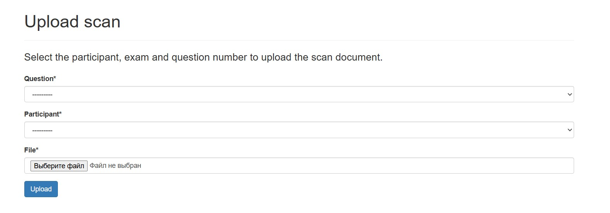
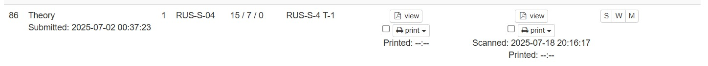
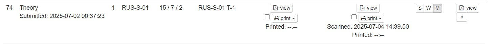

## Сканирование

{: .no_toc }

  
Содержание

  {: .text-delta }
- TOC
{:toc}

---

## Вручную

Можно загрузить сканы вручную через `Admin tools → Upload scans`.

Тогда скан будет отображаться просто в `Admin tools → Bulk print / scan status`, а статус `S/W/M` (submitted / warning / missing pages) проставляется вручную.

---

## Scan worker

- **Оффициальный репозиторий:** <https://gitlab.com/oly-exams/scan_worker>
- **Наш репозиторий с модифицированой версией:** <> 

Scan worker позволяет обработать сканы (отделить answer sheets, working sheets, extra sheets и упорядочить их) и загрузить их на сайт.

В этом случае обработанный скан будет доступен там же, где был доступен скан при ручной загрузке, а оригинальный — справа от статуса. Статус будет выставлен автоматически исходя из количества страниц на сайте (цифры `15/7/9`).

Во избежание дополнительных проверок желательно, чтобы участники сдавали **все** листы ответов / рабочие / дополнительные, которые у них были.

В нашей модифицированой, старая версии есть ещё дополнительный флаг, который позволяет работать и без сайта

### Установка

TODO

### Настройка Логирования

TODO

### Работа со Scan worker

TODO

Используйте `process_folder.sh`, чтобы обработать папку.

Если необходимо сохранить обработанные файлы без загрузки на сайт, используйте флаг `--only-store-evaluated-file`.

Не забудьте указать API-ключ — он лежит в common settings.