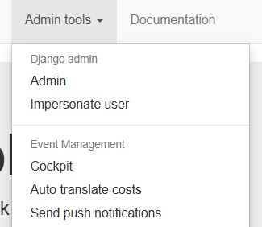
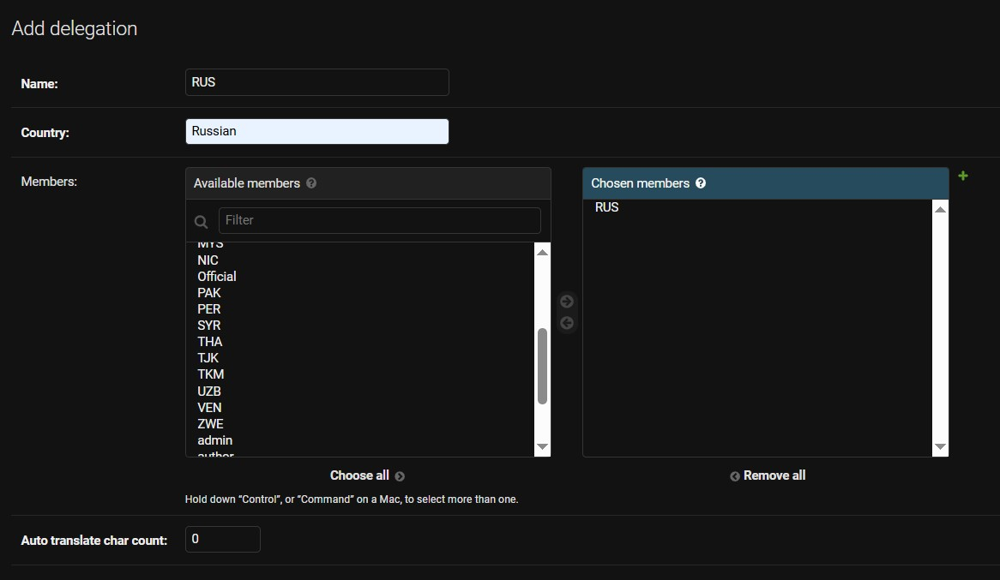
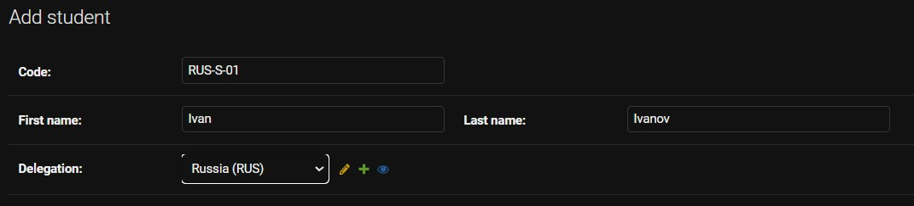
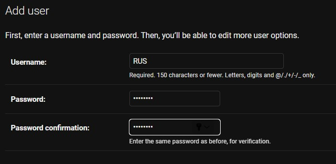
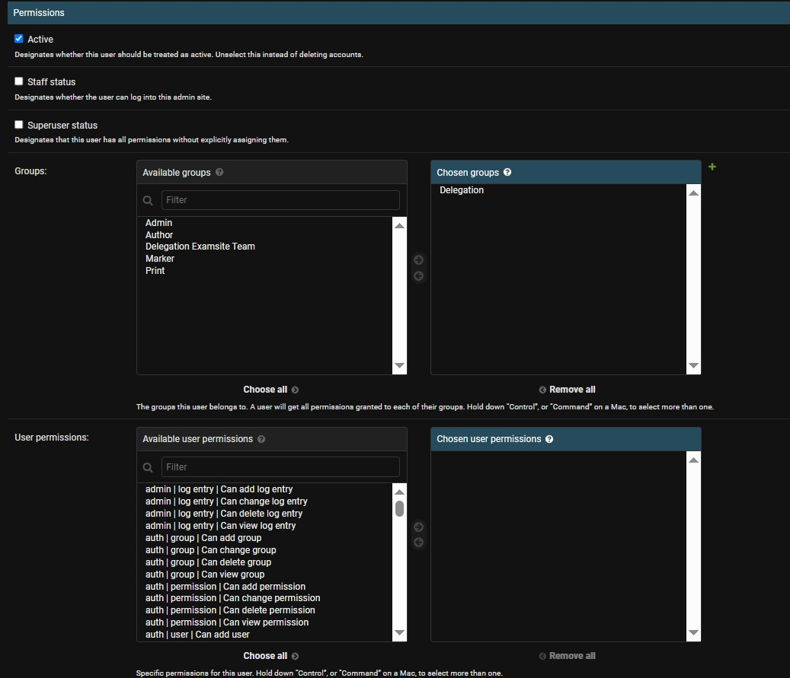

# Интсрументы админа
{: .no_toc }

  
Содержание

  {: .text-delta }
- TOC
{:toc}

---

## Impersonate user

Позволяет админу совершать действия от имени другого пользователя.

## Cockpit

Позволяет переключать фазы.

Фазы определяют текущие права пользователей исходя из их групп. В любой момент можно переключиться на любую фазу. Они расположены в том порядке, в котором должны идти в течение экзамена.

---
## Создание аккаунтов/участников

### Создание делегаций

Делегации задаются через `django admin → Delegations`.

В поле **Users** указываются только тим-лиды.

### Создание участников

Участники задаются через `django admin → Students`.

> **Внимание.** В кодах участников могут быть только буквы, цифры и тире. Если использовать другие символы, могут возникнуть проблемы при сборке комплектов для участников.

Для каждого студента нужно создать так же `объект` его учатсия в каждом мероприятии в `django admin → Participants'.

### Создание аккаунтов тим-лидов

Аккаунты тим-лидов создаются через `django admin → Users`. При создании указываются только логин и пароль.

После создания аккаунт нужно дополнительно отредактировать.

В группе необходимо указать `Delegation`. В правах ничего указывать не нужно — все необходимые права приходят через группу. Не забудьте после этого указать тим-лида в соответствующей делегации.

### Другие аккаунты

Процесс такой же, как для тим-лида, только в группе нужно указать соответствующую группу.

---
## Возможные проблемы и методы их решения

TODO